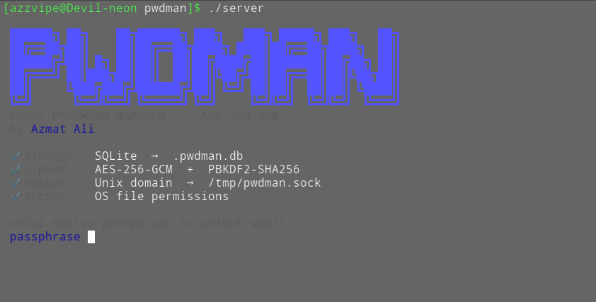
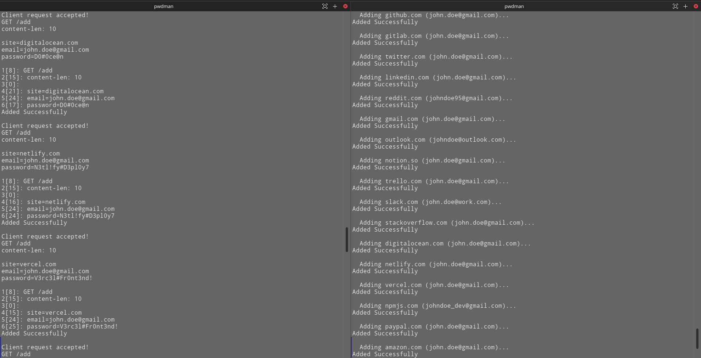
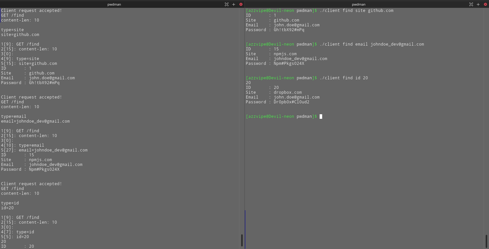

# 🔐 pwdman

A local password manager written in C using Unix sockets, SQLite, and
AES-256-GCM encryption.

All data stays on your machine.

---



---

## ✨ Features

- 🔒 **AES-256-GCM encryption** - every stored password is encrypted at rest
  with an authenticated cipher; tampering is detected
- 🔑 **PBKDF2 key derivation** - your master passphrase is never stored; the
  encryption key is derived fresh each session with 200,000 SHA-256 iterations
- 🗄️ **SQLite storage** - lightweight, single-file, zero-dependency database
- 🔌 **Unix domain socket IPC** - client/server architecture over a local
  socket; no network exposure
- ✅ **Input validation** - email, site, and ID fields are validated before any
  operation
- 🛡️ **Prepared statements** - all SQL uses `sqlite3_bind_*`; no string
  interpolation, no injection

---

## 🏗️ Architecture

```
┌─────────────────────────────────────────────────────┐
│                      client                         │
│  CLI args → command.c → request → Unix socket       │
└─────────────────────────┬───────────────────────────┘
                          │ AF_UNIX socket
                          ▼
┌─────────────────────────────────────────────────────┐
│                      server                         │
│                                                     │
│  select() loop → pwdman_request.c → pwdman.c        │
│                       ↓                             │
│               crypto.c (AES-256-GCM)                │
│                       ↓                             │
│               database.c → .pwdman.db               │
│                                                     │
│  pwdman_response.c → write() → socket               │
└─────────────────────────────────────────────────────┘
```

The server handles all encryption and database operations. The client is
intentionally thin - it parses CLI arguments, builds a request, sends it over
the socket, and prints the response.

---

## 📝 Implementation Notes

This project was built primarily to deepen my understanding of:

- Unix domain sockets and IPC
- AES-GCM authenticated encryption
- SQLite prepared statements
- event-driven server loops using `select()`
- secure handling of user credentials in C

One challenge during development was designing a simple request/response
protocol while keeping encryption isolated to the server process.

Another area I spent time on was input validation and avoiding unsafe string
handling patterns common in C projects.

---

## 🗂️ Project Structure

```
pwdman/
├── src/
│   ├── pwdman.c            # Core CRUD logic
│   ├── pwdman_request.c    # Request validation and dispatch
│   ├── pwdman_response.c   # Response formatting and write
│   ├── command.c           # CLI argument parsing and validation
│   ├── database.c          # SQLite connection and DDL
│   ├── db_stmt.c           # Prepared statement helpers
│   └── crypto.c            # AES-256-GCM encrypt/decrypt, PBKDF2
├── include/
│   ├── pwdman.h
│   ├── command.h
│   ├── database.h
│   ├── db_stmt.h
│   ├── crypto.h
│   ├── resdef.h            # Status codes
│   └── rescodes.h          # Status code descriptors
├── lib/                    # Pre-compiled helper libraries (no source available)
│   ├── sock_lib.{h,o}      # Unix socket wrappers
│   ├── request.{h,o}       # HTTP-style request parser
│   ├── list.{h,o}          # Linked list (co-authored with S. Muktar)
│   ├── iter.{h,o}          # List iterator
│   ├── str.{h,o}           # String utilities
│   ├── validator.{h,o}     # Email/site/number validators
│   └── sqlite3.{h,o}       # SQLite amalgamation
├── server.c                # Server entry point
├── client.c                # Client entry point
├── test.c                  # Test suite
├── seed.sh                 # Demo data seeding script
└── Makefile
```

---

## 🔧 Prerequisites

| Dependency       | Purpose                                     |
| ---------------- | ------------------------------------------- |
| `gcc`            | Compilation                                 |
| `make`           | Build system                                |
| `libssl-dev`     | AES-256-GCM via OpenSSL                     |
| `libsqlite3-dev` | SQLite (header only; amalgamation included) |

Install on Debian/Ubuntu:

```bash
sudo apt install build-essential libssl-dev libsqlite3-dev
```

Install on Arch:

```bash
sudo pacman -S base-devel openssl sqlite
```

> **Note:** pwdman currently targets **Linux only** due to its use of `AF_UNIX`
> sockets, `select()`, and `crypt_r()`. macOS and BSD ports are a planned
> improvement.

---

## 🚀 Building

```bash
git clone https://github.com/AzzVipe/pwdman.git
cd pwdman
make
```

This produces two binaries in the project root: `server` and `client`.

---

## 📖 Usage

### 1. Start the server

```bash
./server
```

On first run, the server creates `.pwdman.db` and prompts for a master
passphrase. This passphrase is used to derive the AES-256 encryption key - **it
is never stored anywhere**. You will need to enter the same passphrase every
time you start the server.

---




---

```
Master passphrase: ••••••••••••
✅ Server starting...
```

> ⚠️ **If you forget your master passphrase, your stored passwords cannot be
> recovered.** There is no reset mechanism by design.

### 2. Run client commands

In a separate terminal:

```bash
# Add a new entry
./client add <site> <email> <password>

# List all entries
./client list

# Find by site
./client find site <site>

# Find by email
./client find email <email>

# Find by ID
./client find id <id>

# Update an entry
./client update <id> <site> <email> <password>

# Delete an entry
./client delete <id>
```

---



---

### Example session

```bash
$ ./client add github.com john@example.com mysecretpassword
Added Successfully

$ ./client list
ID       : 1
Site     : github.com
Email    : john@example.com
Password : mysecretpassword

$ ./client find site github
ID       : 1
Site     : github.com
Email    : john@example.com
Password : mysecretpassword

$ ./client delete 1
Deleted Successfully
```

---

## 🔒 Security Model

| Property          | Detail                                                   |
| ----------------- | -------------------------------------------------------- |
| Encryption        | AES-256-GCM (authenticated encryption)                   |
| Key derivation    | PBKDF2-SHA256, 200,000 iterations                        |
| Salt              | Fixed per-build (single-user local tool)                 |
| Storage           | Ciphertext + IV + GCM tag stored in SQLite               |
| SQL               | Prepared statements via `sqlite3_bind_*` throughout      |
| Transport         | AF_UNIX socket - local machine only, no network exposure |
| Master passphrase | Never stored; derived key lives in process memory only   |

**Threat model:** pwdman is designed to protect against an attacker who gains
read access to your `.pwdman.db` file. The GCM tag also detects any tampering
with stored ciphertext. It is **not** designed to protect against an attacker
with full local system access or one who can attach a debugger to the running
server process.

**Note on the Unix socket transport:** passwords travel as plaintext between the
client and server processes over the Unix socket. Since the socket is local-only
and protected by OS file permissions, this is acceptable for a single-user local
tool. A future improvement would be to move encryption to the client side so
plaintext never leaves the client process.

---

## 🛣️ Roadmap

- [ ] Client-side encryption (plaintext never crosses the socket)
- [ ] Per-entry salt for PBKDF2
- [ ] Password generator built into the `add` command
- [ ] macOS / BSD portability

---

## 🤝 Contributing

This is a personal project but PRs and issues are welcome. If you find a
security issue please open a private issue rather than a public one.

---

## 📄 License

MIT License - see [LICENSE](LICENSE) for details.
